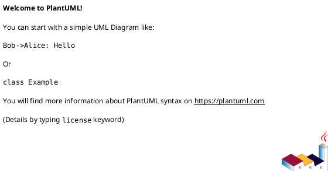

# Code Techniques

[<-Home](../README.md)

## Contents
[Comments](#comments) 

<a name="comments"/>

## Comments

Single-line comments start with single quote

Multi-line comments use slash-and-quote

