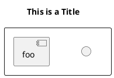
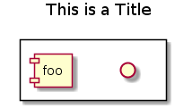
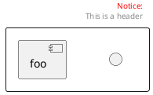
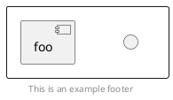
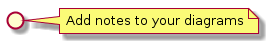
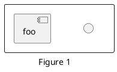
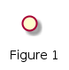
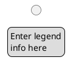

# Diagram Features

[<-Home](../README.md)

## Contents
[Title](#title) 
[Header](#header) 
[Footer](#footer) 
[Note](#note) 
[Caption](#caption) 
[Legend](#legend) 

<a name="title"/>

## Title

<a name="header"/>

## Header

<a name="footer"/>

## Footer

<a name="note"/>

## Note

Add comments (notes) to your diagram

```plantuml
@startuml
() " " as u1
note as n1
    Add notes to your diagrams
end note
n1 -left- u1
@enduml
```

<a name="caption"/>

## Caption

Add caption to your diagram

<a name="legend"/>

## Legend

Add legend to your diagram

