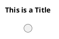

# Diagram Features

[<-Home](../README.md)

## Contents
[Title](#title) 
[Header](#header) 
[Footer](#footer) 
[Note](#note) 

<a name="title"/>

## Title

<a name="header"/>

## Header

```plantuml
@startuml
header
<font color=red>Notice:</font>
This is a header
endheader
() " " as u1
@enduml
```

<a name="footer"/>

## Footer

```plantuml
@startuml
() " " as u1
center footer This is an example footer
@enduml
```

<a name="note"/>

## Note

Add comments (notes) to your diagram

```plantuml
@startuml
() " " as u1
note as n1
    Add notes to your diagrams
end note
n1 -left- u1
@enduml
```

