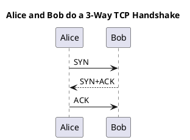
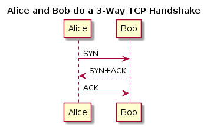
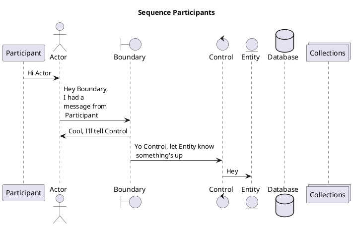
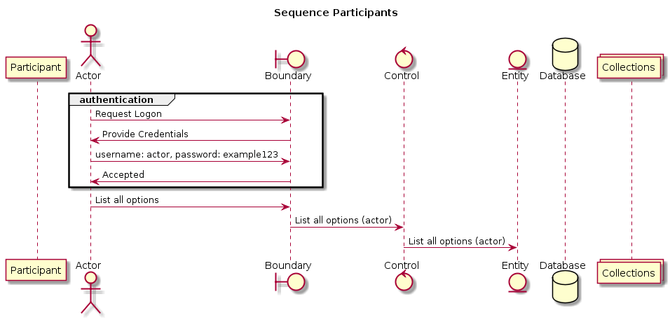

# Diagram Types

[<-Home](../README.md)

PlantUML auto-detects the diagram type based on the first unique item in the code

## Contents
[Sequence Diagram](#sequence-diagram) 
[Use Case Diagram](#use-case-diagram) 
[Class Diagram](#class-diagram) 
[Activity Diagram](#activity-diagram) 

UNDER CONSTRUCTION

<a name="sequence-diagram"/>

## Sequence Diagram

Sequence diagrams present ordered events that occur between participants (actors) over time (which runs top-to-bottom)

Here is a simple example:

There are multiple types of participant that can be used to trigger a sequence diagram, as per the types in the example below:

The order that that participants is declared determines their order left to right in the diagram, and the order of the events is the order top to bottom

<a name="use-case-diagram"/>

## Use Case Diagram

TBD

Auto detect use case diagram type by TBD

<a name="class-diagram"/>

## Class Diagram

TBD

Auto detect class diagram type by use of line type:
* <|--
* *--
* o--
* ..
* --

<a name="activity-diagram"/>

## Activity Diagram

TBD

Auto detect activity diagram type by lines that start with : and end with ;

