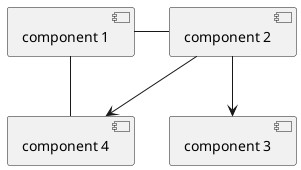
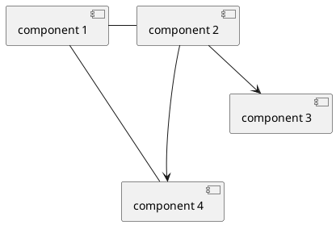
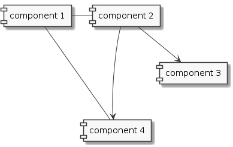

# Hidden Lines

Use hidden lines as a work-around to give hints to PlantUML as to how to lay out the diagram

## Without Hidden Lines

## With Hidden Lines to align components 2 & 4

## Types of Hidden Line

TBD