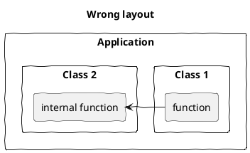
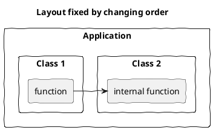

# Other Layout Tricks

[<-Home](../README.md)

Use hidden lines as a work-around to give hints to PlantUML as to how to lay out the diagram

## Change Component Order

This isn't working, Class 1 should be on left:

A fix is to reverse the order of the components in the code:

