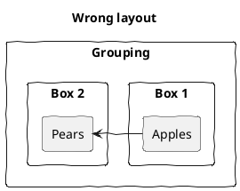
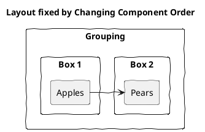

# Other Layout Tricks

[<-Home](../README.md)

Here are some other tricks for fixing layout issues that may help.

## Change Component Order

Let's assume we want Box 1 on the left. We used the 'right' tag, however this isn't working:

A fix is to reverse the order of the components in the code:

