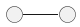

# Lines

[<-Home](../README.md)

## Contents
[Vertical Line](#default_vertical) 

<a name="default_vertical"/>

## Vertical Line

Double dash

```plantuml
@startuml
() " " as u1
() " " as u2
u1 -- u2
@enduml
```

## Horizontal Line

Single dash

```plantuml
@startuml
() " " as u1
() " " as u2
u1 - u2
@enduml
```

