# Lines

[<-Home](../README.md)

## Contents
[Vertical Line](#vertical_line) 
[Vertical Dashed Line](#vertical_dashed_line) 
[Horizontal Line](#horizontal_line) 
[Line Color](#line_color) 

<a name="vertical_line"/>

## Vertical Line

Double dash

<a name="vertical_dashed_line"/>

## Vertical Dashed Line

Double dot or *dashed* keyword in square brackets

<a name="horizontal_line"/>

## Horizontal Line

Single dash

<a name="line_color"/>

## Line Color

Specify line color in square brackets in the line characters:

```plantuml
@startuml
skinparam interface {
	BorderColor black
	BackgroundColor white
}
() " " as u1
() " " as u2
u1 -[#blue] u2
u1 -[#green]-> u2
u1 <-[#mediumvioletred]-> u2
@enduml
```

