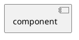
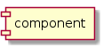
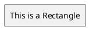
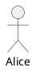

# Objects

[<-Home](../README.md)

## Contents
[Component](#component) 

<a name="component"/>

## Component

<a name="interface"/>

## Interface

```plantuml
@startuml
() "This is an interface" as myInterface
@enduml
```

<a name="rectangle"/>

## Rectangle

<a name="actor"/>

## Actor

Note that if you use keyword 'actor', it will assume format of a sequence diagram. Use colons around actor name instead.

