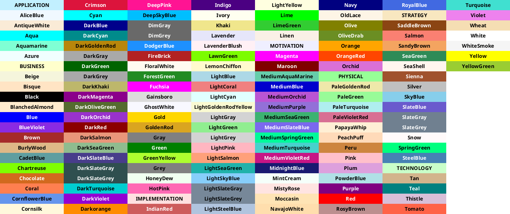
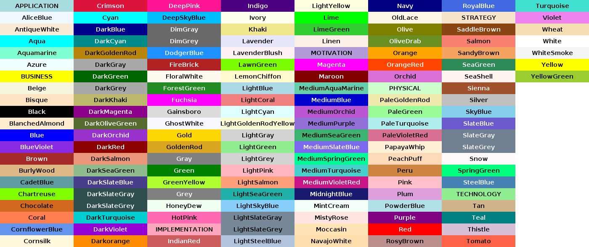
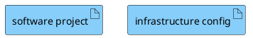
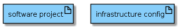
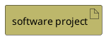
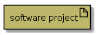

# Colors

[<-Home](../README.md)

List the colors with:

Which gives something like this:

Change the color of all objects of a particular type, use skinparam for the type, example:

Change the color of a single item, specify color at end after a hash. Example:

