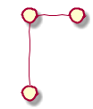
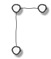

# Styles

##### Table of Contents  
[Default](#default)  
[Monochrome](#monochrome) 
[Reverse Monochrome](#reverse_monochrome)
[Handwritten](#handwritten)
[Monochrome Handwritten](#monochrome_handwritten)

<a name="default"/>
## Default

```plantuml
@startuml
' Default style
() " " as u1
() " " as u2
() " " as u3
u1 -- u2
u1 - u3
@enduml
```

<a name="monochrome"/>
## Monochrome

<a name="reverse_monochrome"/>
## Reverse Monochrome

```plantuml
@startuml
' Reverse monochrome style:
skinparam monochrome reverse
() " " as u1
() " " as u2
() " " as u3
u1 -- u2
u1 - u3
@enduml
```

<a name="handwritten"/>
## Handwritten
Note: can combine handwritten with other styles such as monochrome

```plantuml
@startuml
' Handwritten style:
skinparam handwritten true
() " " as u1
() " " as u2
() " " as u3
u1 -- u2
u1 - u3
@enduml
```

<a name="monochrome_handwritten"/>
## Monochrome Handwritten

