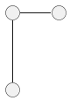
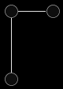
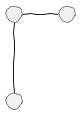

# Styles

## Default

```plantuml
@startuml
' Default style
() " " as u1
() " " as u2
() " " as u3
u1 -- u2
u1 - u3
@enduml
```

## Monochrome

```plantuml
@startuml
' Monochrome style:
skinparam monochrome true
() " " as u1
() " " as u2
() " " as u3
u1 -- u2
u1 - u3
@enduml
```

## Reverse Monochrome

```plantuml
@startuml
' Reverse monochrome style:
skinparam monochrome reverse
() " " as u1
() " " as u2
() " " as u3
u1 -- u2
u1 - u3
@enduml
```

## Handwritten

Note: can combine handwritten with other styles such as monochrome

```plantuml
@startuml
' Handwritten style:
skinparam handwritten true
() " " as u1
() " " as u2
() " " as u3
u1 -- u2
u1 - u3
@enduml
```

