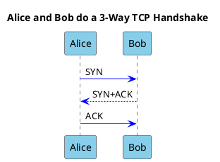
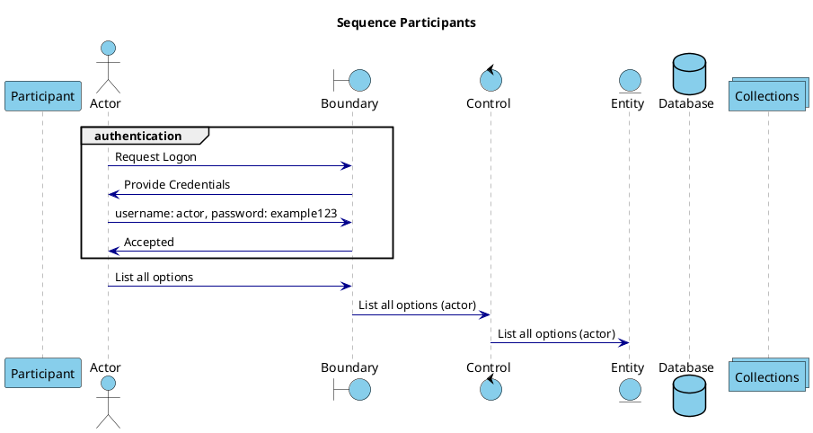
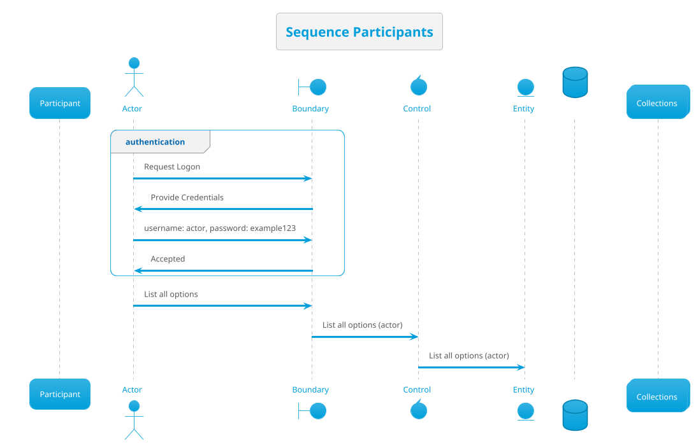
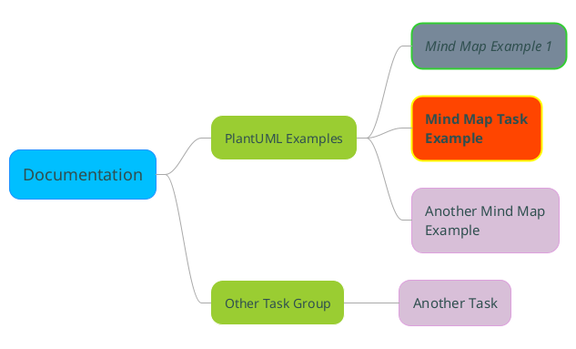

# Diagram Types

[<-Home](../../README.md)

PlantUML auto-detects the diagram type based on the first unique item in the code

## Contents
[Sequence Diagram](#sequence-diagram) 
[Mind Map](#mindmap-diagram) 
[Mind Map of Tasks](#mindmap-diagram-tasks) 
[Deployment Diagrams](#deployment-diagrams) 
[Component Diagrams](#component-diagrams) 
[C4 Model Diagrams](../Examples/README.md#c4-model) 
[Use Case Diagram](#use-case-diagram) 
[Class Diagram](#class-diagram) 
[Activity Diagram](#activity-diagram) 

UNDER CONSTRUCTION

<a name="sequence-diagram"/>

## Sequence Diagram

Sequence diagrams present ordered events that occur between participants (actors) over time (which runs top-to-bottom)

Here is a simple example:

There are multiple types of participant that can be used to trigger a sequence diagram, as per the types in the example below:

The order that that participants is declared determines their order left to right in the diagram, and the order of the events is the order top to bottom

Here is the same diagram, but with simpler set-up code, thanks to use of a theme:

Another example showing setting colours etc:

## Mind Map Diagram

Mind map diagrams are a great way to quickly break a problem or concept down into smaller parts.

Here is a simple example:

<a name="mindmap-diagram-tasks"/>

## Mind Map Diagram of Tasks

Here we create a Mind Map to track tasks, with visual tags for urgent and completed:

<a name="deployment-diagrams"/>

## Deployment Diagrams

This isn't strictly a UML Deployment Diagram, but is similar:

[source code](source/deployment-like-diagram.md)

<a name="component-diagrams"/>

## Component Diagrams

TBD

<a name="use-case-diagram"/>

## Use Case Diagram

TBD

Auto detect use case diagram type by TBD

<a name="class-diagram"/>

## Class Diagram

TBD

Auto detect class diagram type by use of line type:
* <|--
* *--
* o--
* ..
* --

<a name="activity-diagram"/>

## Activity Diagram

TBD

Auto detect activity diagram type by lines that start with : and end with ;

<a name="mindmap-diagram"/>