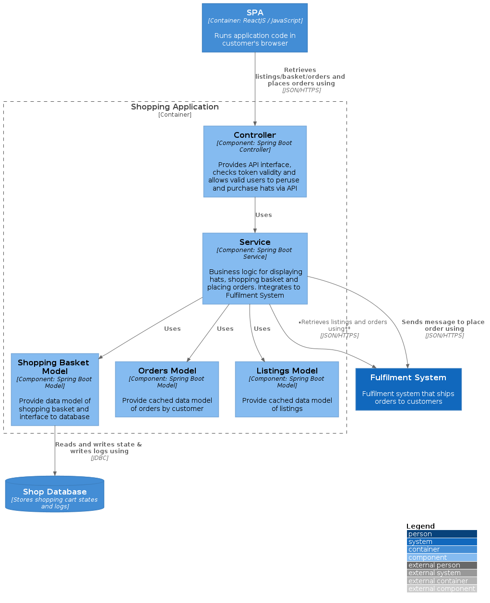

[<-Diagram Types](../diagram-types.md)

# C4 Model Component Diagram



Source code:
```plantuml
@startuml
!include https://raw.githubusercontent.com/plantuml-stdlib/C4-PlantUML/master/C4_Component.puml

skinparam wrapWidth 200
skinparam maxMessageSize 200

LAYOUT_WITH_LEGEND()

Container(spa, "SPA", "Container: ReactJS / JavaScript", "Runs application code in customer's browser")

Container_Boundary(shop, "Shopping Application") {
    Component(controller, "Controller", "Component: Spring Boot Controller", "Provides API interface, checks token validity and allows valid users to peruse and purchase hats via API")
    Component(service, "Service", "Component: Spring Boot Service", "Business logic for displaying hats, shopping basket and placing orders. Integrates to Fulfilment System")
    Component(basket_model, "Shopping Basket Model", "Component: Spring Boot Model", "Provide data model of shopping basket and interface to database")
    Component(orders_model, "Orders Model", "Component: Spring Boot Model", "Provide cached data model of orders by customer")
    Component(listings_model, "Listings Model", "Component: Spring Boot Model", "Provide cached data model of listings")
}

ContainerDb(db_shop, "Shop Database", "Stores shopping cart states and logs")

System(fulfil, "Fulfilment System", "Fulfilment system that ships orders to customers")

Rel(spa, controller, "Retrieves listings/basket/orders and places orders using", "JSON/HTTPS")
Rel(controller, service, "Uses")
Rel(service, basket_model, "Uses")
Rel(service, orders_model, "Uses")
Rel(service, listings_model, "Uses")
Rel(basket_model, db_shop, "Reads and writes state & writes logs using", "JDBC")
Rel(service, fulfil, "Retrieves listings and orders\nusing", "JSON/HTTPS")
Rel(service, fulfil, "Sends message to place order using", "JSON/HTTPS")
@enduml
```