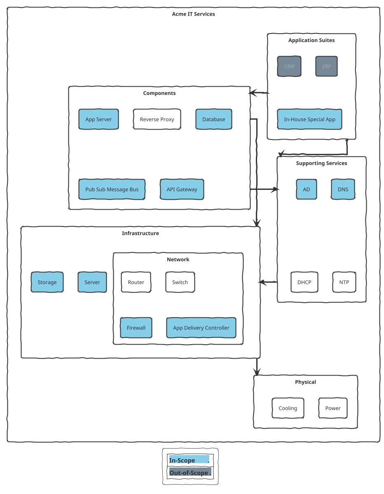

[<-Diagram Types](../diagram-types.md)

# Deployment-Like Diagram

This isn't strictly a UML Deployment Diagram, but is similar:

Source code:

```plantuml
@startuml
!theme sketchy-outline
hide stereotype

skinparam linetype ortho

<style>
  ' Styles to apply to components to indicate something of note:
  ' in-scope (<<i>>)
  .i {
    BackgroundColor SkyBlue
  }
  ' out-of-scope (<<o>>)
  .o {
    BackgroundColor LightSlateGray
    FontStyle italic
    FontColor DarkGray
  }
}
</style>
' Legend colours need to be updated manually :-(
legend
|<back:SkyBlue><b>In-Scope        .</b></back>|
|<back:LightSlateGrey><b>Out-of-Scope .</b></back>|
endlegend

rectangle "Acme IT Services" {
    rectangle "Application Suites" as apps {
        rectangle ERP <<o>>
        rectangle CRM <<o>>
        rectangle "In-House Special App" <<i>>
    }
    rectangle "Components" as components {
        rectangle "App Server" <<i>>
        rectangle "Reverse Proxy"
        rectangle "Database" <<i>>
        rectangle "Pub Sub Message Bus" <<i>>
        rectangle "API Gateway" <<i>>
    }
    rectangle "Supporting Services" as sup_svces {
        rectangle AD <<i>>
        rectangle DNS <<i>>
        rectangle DHCP
        rectangle NTP
    }
    rectangle Infrastructure as infra {
        rectangle Network {
            rectangle Router
            rectangle Switch
            rectangle Firewall <<i>>
            rectangle "App Delivery Controller" <<i>>
        }
        rectangle Server <<i>>
        rectangle Storage <<i>>
    }
    rectangle Physical as phy {
        rectangle Power
        rectangle Cooling
    }
}

infra ---> phy
sup_svces --> infra
apps --> sup_svces
apps --> components
components --> sup_svces
components --> infra

@enduml
```