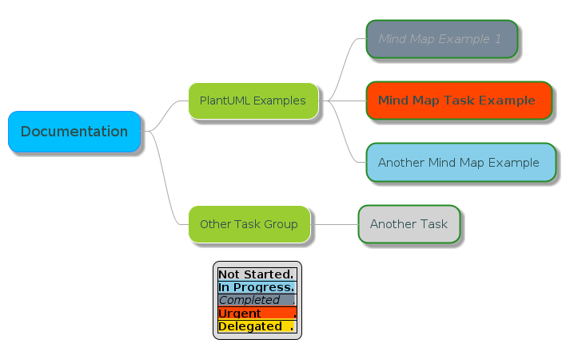
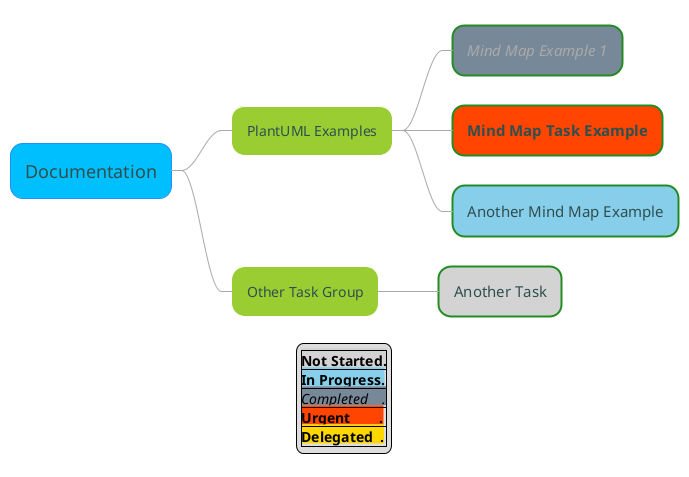

Mind Map of Tasks Example

[<-Diagram Types](../diagram-types.md)

Source code:

```plantuml
@startmindmap
skinparam ArrowColor DarkGrey
<style>
mindmapDiagram {
  node {
    Padding 15
    Margin 15
    BackGroundColor YellowGreen
    FontColor DarkSlateGrey
    LineColor white
    LineThickness 1.0
    MaximumWidth 320
  }
  rootNode {
    Padding 15
    Margin 15
    BackGroundColor DeepSkyBlue
    FontColor DarkSlateGrey
    FontSize 18
    LineColor DodgerBlue
    LineThickness 1.0
  }
  leafNode {
    Padding 15
    Margin 15
    BackGroundColor LightGray
    FontColor DarkSlateGrey
    FontSize 15
    LineColor ForestGreen
    LineThickness 2.0
  }
  ' Styles to apply to tasks based on status:
  ' in progress (i)
  .i {
    BackgroundColor SkyBlue
  }
  ' completed (c)
  .c {
    BackgroundColor LightSlateGray
    FontStyle italic
    FontColor DarkGray
  }
  ' urgent (u)
  .u {
    BackgroundColor OrangeRed
    FontStyle bold
  }
  ' delegated (d)
  .d {
    BackgroundColor Gold
  }
}
</style>
' Legend colours need to be updated manually :-(
legend
|<back:LightGray><b>Not Started.</b></back>|
|<back:SkyBlue><b>In Progress.</b></back>|
|<back:LightSlateGrey><i>Completed    .</i></back>|
|<back:OrangeRed><b>Urgent        .</b></back>|
|<back:Gold><b>Delegated  .</b></back>|
endlegend

* Documentation
** PlantUML Examples
*** Mind Map Example 1 <<c>>
*** Mind Map Task Example <<u>>
*** Another Mind Map Example <<i>>
** Other Task Group
*** Another Task

@endmindmap
```