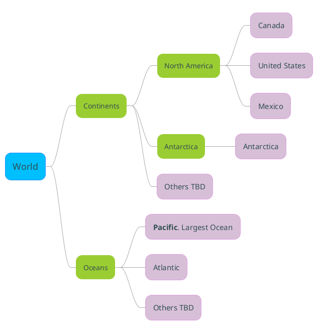

[<-Diagram Types](../diagram-types.md)

Mind Map Example:

Source code:

```plantuml
@startmindmap
skinparam ArrowColor DarkGrey
<style>
mindmapDiagram {
  node {
    Padding 15
    Margin 15
    BackGroundColor YellowGreen
    FontColor DarkSlateGrey
    LineColor white
    LineThickness 1.0
    MaximumWidth 180
  }
  rootNode {
    Padding 15
    Margin 15
    BackGroundColor DeepSkyBlue
    FontColor DarkSlateGrey
    FontSize 18
    LineColor DodgerBlue
    LineThickness 1.0
  }
  leafNode {
    Padding 15
    Margin 15
    BackGroundColor Thistle
    FontColor DarkSlateGrey
    FontSize 15
    LineColor Plum
    LineThickness 1.0
  }
}
</style>
* World
 * Continents
  * North America
   * Canada
   * United States
   * Mexico
  * Antarctica
   * Antarctica
  * Others TBD
 * Oceans
  * **Pacific**. Largest Ocean
  * Atlantic
  * Others TBD

@endmindmap
```
