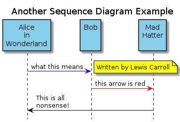
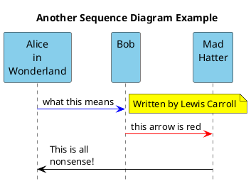

[<-Diagram Types](../diagram-types.md)

Sequence Diagram - Another Example:

Source code:

```plantuml
@startuml

Title Another Sequence Diagram Example

skinparam ParticipantBackgroundColor SkyBlue
skinparam ParticipantBorderColor Black

' Set default colours for the horizontal arrows and vertical traces: 
skinparam sequence {
    ArrowColor blue
    LifeLineBorderColor black
}

' disable the bottom boxes for aesthetic reasons:
hide footbox 

' Set default colors for notes:
skinparam NoteBackgroundColor Yellow
skinparam NoteBorderColor black

' Participants:
participant “Alice\nin\nWonderland” as alice
participant “Bob\n\n” as bob
participant “Mad\nHatter\n” as hatter

alice -> bob: what this means
note right: Written by Lewis Carroll

bob -[#red]> hatter: this arrow is red

hatter -[#black]> alice: This is all\nnonsense!
@enduml
```
