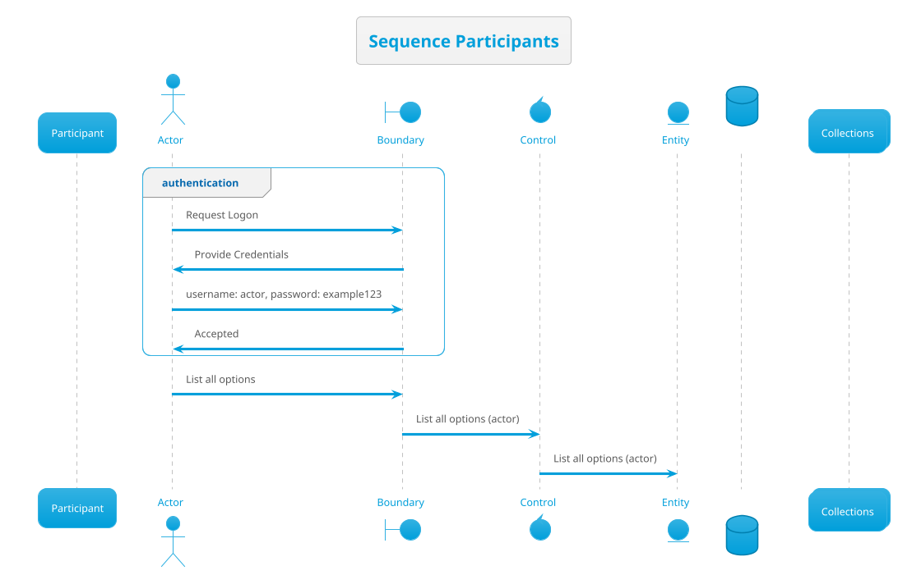

[<-Diagram Types](../diagram-types.md)

Sequence Diagram with Participants and using a Theme:

Source code:

```plantuml
@startuml
!theme bluegray
title Sequence Participants

' Specify the participants left to right:
participant Participant
actor Actor
boundary Boundary
control Control
entity Entity
database Database
collections Collections
' Specify the events (in order):
group authentication
    Actor -> Boundary: Request Logon
    Boundary -> Actor: Provide Credentials
    Actor -> Boundary: username: actor, password: example123
    Boundary -> Actor: Accepted
end
Actor -> Boundary: List all options
Boundary -> Control: List all options (actor)
Control -> Entity: List all options (actor)
@enduml
```
