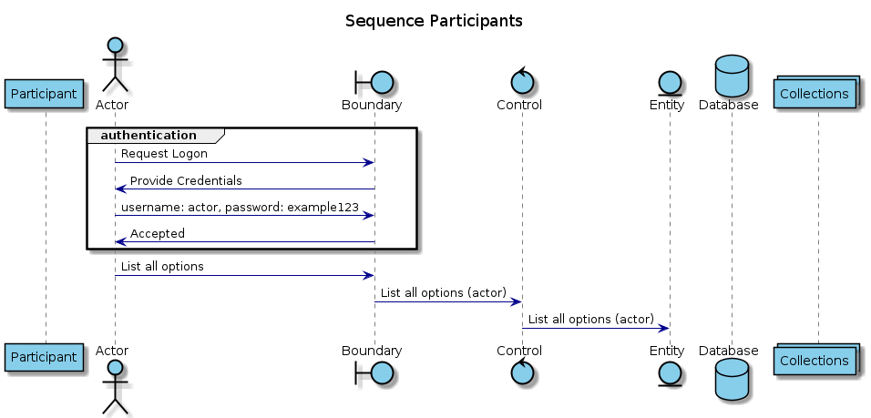
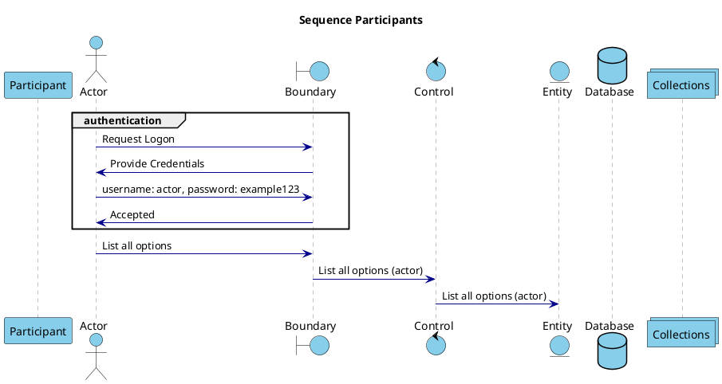

Sequence Diagram with Participants

[<-Diagram Types](../diagram-types.md)

Source code:

```plantuml
@startuml
title Sequence Participants

' Set colors:
skinparam ParticipantBackgroundColor skyblue
skinparam ParticipantBorderColor black
skinparam ArrowColor darkblue
skinparam ActorBorderColor black
skinparam ActorBackgroundColor skyblue
skinparam BoundaryBorderColor black
skinparam BoundaryBackgroundColor skyblue
skinparam ControlBorderColor black
skinparam ControlBackgroundColor skyblue
skinparam EntityBorderColor black
skinparam EntityBackgroundColor skyblue
skinparam DatabaseBorderColor black
skinparam DatabaseBackgroundColor skyblue
skinparam CollectionsBorderColor black
skinparam CollectionsBackgroundColor skyblue

skinparam Sequence {
    LifelineBorderColor gray
}

' Specify the participants left to right:
participant Participant
actor Actor
boundary Boundary
control Control
entity Entity
database Database
collections Collections
' Specify the events (in order):
group authentication
    Actor -> Boundary: Request Logon
    Boundary -> Actor: Provide Credentials
    Actor -> Boundary: username: actor, password: example123
    Boundary -> Actor: Accepted
end
Actor -> Boundary: List all options
Boundary -> Control: List all options (actor)
Control -> Entity: List all options (actor)
@enduml
```

