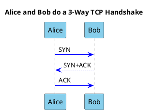

[<-Diagram Types](../diagram-types.md)

Simple Sequence Diagram:

Source code:

```plantuml
@startuml
title Alice and Bob do a 3-Way TCP Handshake

skinparam ParticipantBackgroundColor SkyBlue
skinparam ParticipantBorderColor Black

' Set default colours for the horizontal arrows and vertical traces: 
skinparam sequence {
    ArrowColor blue
    LifeLineBorderColor black
}

Alice -> Bob: SYN
Bob --> Alice: SYN+ACK
Alice -> Bob: ACK

@enduml
```

