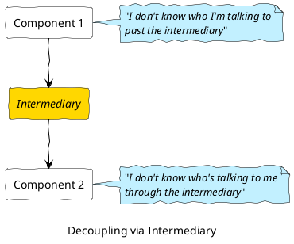
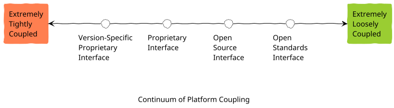
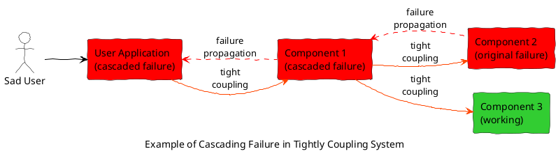
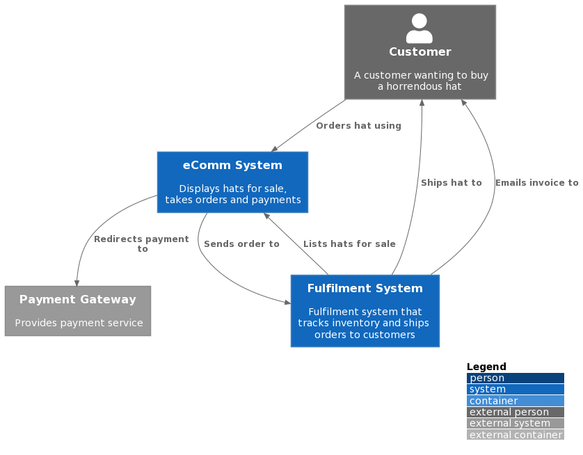
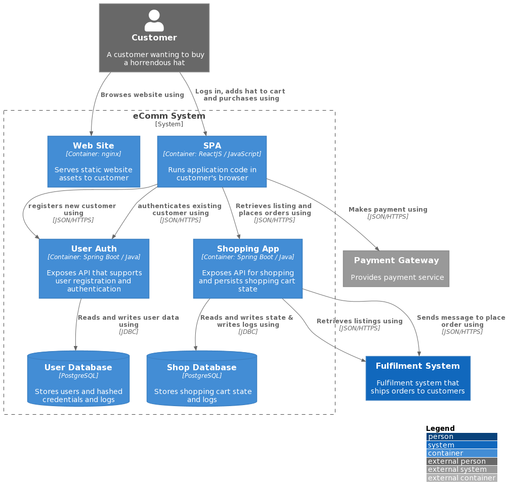

# Assorted Example Diagrams
Assorted examples of diagrams I've used in blog posts:

[<-Home](../../README.md)

## Contents
[IT Arch - Coupling](#itarch-coupling)<br>
[Diagrams with C4 Model](#c4-model)<br>

<a name="itarch-coupling"/>

## IT Architecture – A Discussion on Coupling

Here are a few example diagrams from post [IT Architecture – A Discussion on Coupling](https://mattjhayes.com/2020/04/18/it-architecture-a-discussion-on-coupling/)




A continuum:




A component diagram:




<a name="c4-model"/>

## Diagrams with C4 Model

Here are the diagrams from the blog post [Diagrams with C4 Model](https://mattjhayes.com/2020/05/10/diagrams-with-c4-model/)

Note that the C4 library has come along heaps since I wrote that post, check out  [plantuml-stdlib/C4-PlantUML](https://github.com/plantuml-stdlib/C4-PlantUML) 

### C4 Context Diagram

```plantuml
@startuml
!include https://raw.githubusercontent.com/plantuml-stdlib/C4-PlantUML/master/C4_Container.puml

' caption Context Diagram for Horrendous Hats (HH) Website

LAYOUT_WITH_LEGEND()

Person_Ext(customer, "Customer", "A customer wanting to buy a horrendous hat")

System(site, "eComm System", "Displays hats for sale, takes orders and payments")
System(fulfil, "Fulfilment System", "Fulfilment system that tracks inventory and ships orders to customers")

System_Ext(payments, "Payment Gateway", "Provides payment service") 

Rel(customer, site, "Orders hat using")
Rel(site, payments, "Redirects payment to")
Rel(site, fulfil, "Sends order to")
Rel(fulfil, site, "Lists hats for sale")
Rel(fulfil, customer, "Ships hat to")
Rel(fulfil, customer, "Emails invoice to")

@enduml
```


### C4 Container Diagram

```plantuml
@startuml
!include https://raw.githubusercontent.com/plantuml-stdlib/C4-PlantUML/master/C4_Container.puml

skinparam wrapWidth 200
skinparam maxMessageSize 200

LAYOUT_WITH_LEGEND()

Person_Ext(customer, "Customer", "A customer wanting to buy a horrendous hat")

System_Boundary(site, "eComm System"){
    Container(www, "Web Site", "Container: nginx", "Serves static website assets to customer")
    Container(spa, "SPA", "Container: ReactJS / JavaScript", "Runs application code in customer's browser")
    Container(shop, "Shopping App", "Container: Spring Boot / Java", "Exposes API for shopping and persists shopping cart state")
    Container(auth, "User Auth", "Container: Spring Boot / Java", "Exposes API that supports user registration and authentication")
    ContainerDb(db_user, "User Database", "PostgreSQL", "Stores users and hashed credentials and logs")
    ContainerDb(db_shop, "Shop Database", "PostgreSQL", "Stores shopping cart state and logs")
}
System(fulfil, "Fulfilment System", "Fulfilment system that ships orders to customers")

System_Ext(payments, "Payment Gateway", "Provides payment service") 

' fight the layout engine
auth -[hidden]right-> shop

Rel(spa, auth, "registers new customer using", "JSON/HTTPS")
Rel(spa, auth, "authenticates existing customer using", "JSON/HTTPS")

Rel(customer, www, "Browses website using")
Rel(customer, spa, "Logs in, adds hat to cart and purchases using")
Rel(spa, shop, "Retrieves listing and places orders using", "JSON/HTTPS")
Rel(shop, db_shop, "Reads and writes state & writes logs using", "JDBC")
Rel(auth, db_user, "Reads and writes user data using", "JDBC")
Rel(spa, payments, "Makes payment using", "JSON/HTTPS")

Rel(shop, fulfil, "Retrieves listings using", "JSON/HTTPS")
Rel(shop, fulfil, "Sends message to place order using", "JSON/HTTPS")

@enduml
```
