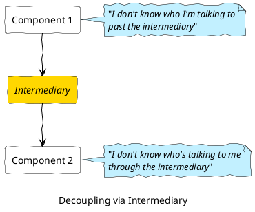
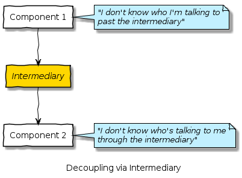

# Assorted Example Diagrams
Assorted examples of diagrams I've used in blog posts:

[<-Home](../../README.md)

## Contents
[IT Arch - Coupling](#itarch-coupling) 

<a name="itarch-coupling"/>

## IT Architecture – A Discussion on Coupling

A couple of diagrams from post [IT Architecture – A Discussion on Coupling](https://mattjhayes.com/2020/04/18/it-architecture-a-discussion-on-coupling/)

