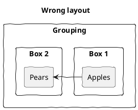
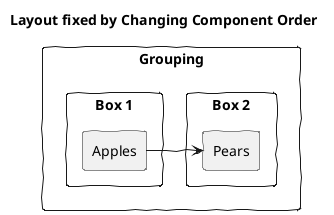
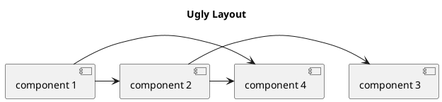
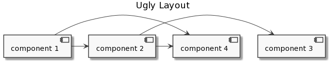
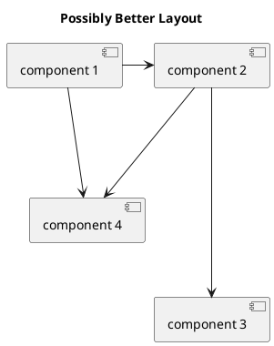
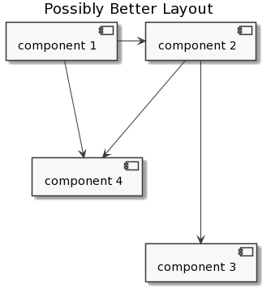

# Other Layout Tricks

[<-Home](../../README.md)

Here are some other tricks, if you've already tried [hidden lines](hidden-lines.md), for fixing layout issues. Your mileage may vary...

## Change Component Order

Let's assume we want Box 1 on the left. We used the 'right' tag, however this isn't working:




A fix is to reverse the order of the components in the code:




## Left to Right

TBD

```plantuml
@startuml
left to right direction
```

## Together

TBD



```plantuml
@startuml
together {
    rectangle "Box 1" as box_1
    rectangle "Box 2" as box_2
}
```

## Longer Lines

Can try extending lengths of lines by adding dashes, examples starting with normal length lines:





Add dashes to lines to make them longer to change layout:





## No Rank

TBD, see https://stackoverflow.com/questions/48712801/how-to-correct-plantuml-line-path/61795202#61795202

## Transparent Nodes

TBD, see https://stackoverflow.com/questions/48712801/how-to-correct-plantuml-line-path/48735216#48735216

## Orthogonal Mode

TBD, see https://stackoverflow.com/questions/48712801/how-to-correct-plantuml-line-path/48735216#48735216

