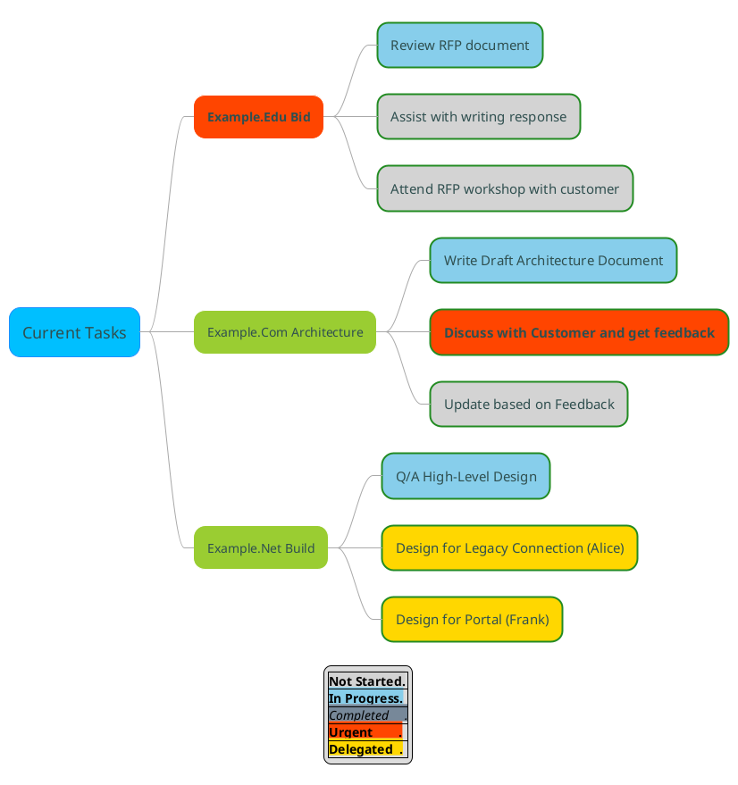

```plantuml
@startmindmap
skinparam ArrowColor DarkGrey
<style>
mindmapDiagram {
  node {
    Padding 15
    Margin 15
    BackGroundColor YellowGreen
    FontColor DarkSlateGrey
    LineColor white
    LineThickness 1.0
    MaximumWidth 320
  }
  rootNode {
    Padding 15
    Margin 15
    BackGroundColor DeepSkyBlue
    FontColor DarkSlateGrey
    FontSize 18
    LineColor DodgerBlue
    LineThickness 1.0
  }
  leafNode {
    Padding 15
    Margin 15
    BackGroundColor LightGray
    FontColor DarkSlateGrey
    FontSize 15
    LineColor ForestGreen
    LineThickness 2.0
  }
  ' Styles to apply to tasks based on status:
  ' in progress (i)
  .i {
    BackgroundColor SkyBlue
  }
  ' completed (c)
  .c {
    BackgroundColor LightSlateGray
    FontStyle italic
    FontColor DarkGray
  }
  ' urgent (u)
  .u {
    BackgroundColor OrangeRed
    FontStyle bold
  }
  ' delegated (d)
  .d {
    BackgroundColor Gold
  }
}
</style>
' Legend colours need to be updated manually :-(
legend
|<back:LightGray><b>Not Started.</b></back>|
|<back:SkyBlue><b>In Progress.</b></back>|
|<back:LightSlateGrey><i>Completed     .</i></back>|
|<back:OrangeRed><b>Urgent        .</b></back>|
|<back:Gold><b>Delegated  .</b></back>|
endlegend

* Current Tasks

 * Example.Edu Bid <<u>>
  * Review RFP document<<i>>
  * Assist with writing response
  * Attend RFP workshop with customer

 * Example.Com Architecture
  * Write Draft Architecture Document <<i>>
  * Discuss with Customer and get feedback<<u>>
  * Update based on Feedback

 * Example.Net Build
  * Q/A High-Level Design <<i>>
  * Design for Legacy Connection (Alice) <<d>>
  * Design for Portal (Frank) <<d>>

@endmindmap
```
