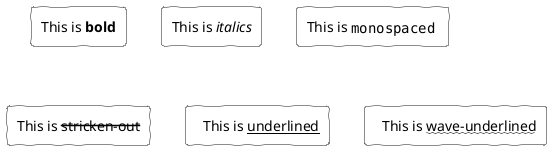
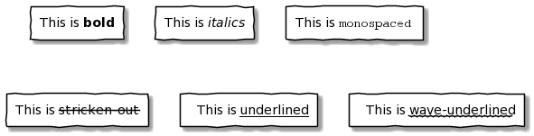

# Fonts

[<-Home](../../README.md)

Font formatting with Creole (font size colour etc.):
see: http://plantuml.com/creole

```plantuml
@startuml
skinparam handwritten true
skinparam RectangleBackgroundColor white
rectangle "This is **bold**"
rectangle "This is //italics//"
rectangle "This is ""monospaced"" "
rectangle "This is --stricken-out--"
rectangle "  This is __underlined__"
rectangle "  This is ~~wave-underlined~~"
@enduml
```

